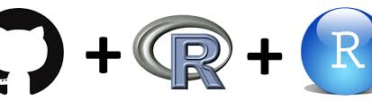

## Quienes sómos ?

**Source Stat Lab** es una empresa Ecuatoriana con sede en Quito especializada en fomentar el avance del conocimiento, misma que presta sus servicios de entrenamiento y capacitación en el *lenguaje de programación R* para profesionales en todas sus verticales (*investigación*, *docencia*, *empresarial*).

<center>

</center>

Source Stat Lab brinda capacitación, reportería y consultoría estadística/matemática con el uso de herramientas de software libre como: R, RStudio, R Analytic Flow & LaTeX a empresas globales y locales, así como instituciones públicas.


--- .class #id 

## Gráficos dinámicos - Multi Bar Chart

Da click sobre los circulos para modificar el gráfico.

```{r results = "asis", comment = NA, echo=FALSE}
library(devtools)
library(rCharts)
library(knitr)
hair_eye_male <- subset(as.data.frame(HairEyeColor), Sex == "Male")
n2 <- nPlot(Freq ~ Hair, group = 'Eye', data = hair_eye_male, type = 'multiBarChart')
n2
```


--- .class #r

## Gráficos dinámicos - Facetted Scatterplot

Coloque el puntero del mouse sobre los puntos para observar sus etiquetas.

```{r results = "asis", comment = NA, echo=FALSE}
names(iris) = gsub("\\.", "", names(iris))
rPlot(SepalLength ~ SepalWidth | Species, data = iris, color = 'Species', type = 'point')
```


--- .class #rr

## Gráficos dinámicos - Morris

Deslice el puntero del mouse sobre las líneas graficadas.

```{r results = "asis", comment = NA, echo=FALSE}
data(economics, package = "ggplot2")
econ <- transform(economics, date = as.character(date))
m1 <- mPlot(x = "date", y = c("psavert", "uempmed"), type = "Line", data = econ)
m1$set(pointSize = 0, lineWidth = 1)
m1$print("chart2")
m1
```

--- .class #ss

## Quieres aprender a manejar R ?

<center>

</center>

#### Ven y preparate con nosotros, garantizamos tu aprendizaje. No pierdas tu inversión y tu tiempo.

<center>

</center>

### Próximamente apertura de cursos en la ciudad de Quito.

--- .class #ssl

## Agradecimientos

Source Stat Lab agradece a todos sus seguidores en redes sociales, y a la vez invita a ser participes de los siguientes cursos:

- R nivel Básico
- R nivel Intermedio
- R nivel Avanzado
- Reportería Dinámica
- Gráficos interactivos
- Gráficos con ggplot2
- Interfaces web con Shiny

Apertura de cursos próximamente. 

Para más información visita nuestra redes sociales (*Facebook*, *Twitter*) como **SourceStatLab**.


